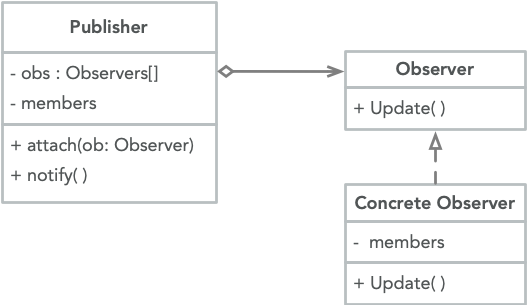

<br>

观察者以发布者初始化

```cpp
Observer(Publisher* pub) : {
    pub->attach(this);
};
```

设置观察者基类，以使发布者维护其观察者的列表。

```cpp
class Observer {
public:
    virtual void update(string msg) = 0;
};

class Subject {
    vector<Observer*> obs;
public:
    void attach(Observer* ob) {
        obs.push_back(ob);
    }
    void send(string msg) {
        for (auto* ob : obs)
            ob->update(msg);
    }
};

class OB1 : public Observer {
public:
    OB1(Subject* sub) {
        sub->attach(this);
    }
    void update(string msg) override {
        cout << "OB1 Get " + msg << endl;
    }
};

int main()
{
    Subject sub;
    OB1 ob1(&sub);
    sub.send("MESSAGE");
}
```
