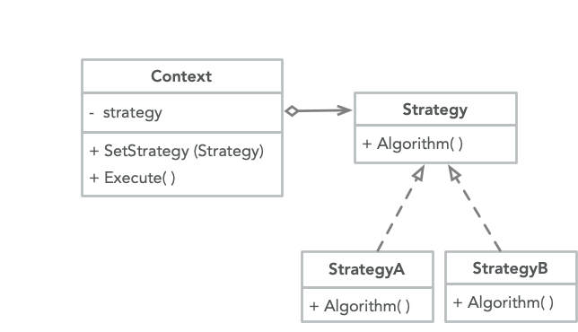

<br>

框架不实现功能而是委托给策略对象

```cpp
class Context {
private:
    Strategy* strategy;
public:
    Context(Strategy* s = nullptr) : strategy(s) {};
    ~Context() { delete this->strategy; }

    void setStrategy(Strategy* s) {
        this->strategy = s;
    }
    void SortAndPrint(vector<int>& arr) {
        strategy->sortArray(arr);
        for (auto& i : arr)
            cout << i << endl;
    }
};
```

在对象层次上运作可以在运行时切换行为

```cpp
class Strategy {
public:
    virtual ~Strategy() = default;
    virtual void sortArray(vector<int>& arr) = 0;
};

class StrategyA : public Strategy {
public:
    void sortArray(vector<int>& arr) override {
        sort(arr.begin(), arr.end(), greater<>());
    }
};

class StrategyB : public Strategy {
public:
    void sortArray(vector<int>& arr) override {
        sort(arr.begin(), arr.end(), less<>());
    }
};

int main()
{
    Context *context = new Context;

    vector<int> v = { 2, 3, 1 };

    context->setStrategy(new StrategyA);
    context->SortAndPrint(v);

    context->setStrategy(new StrategyB);
    context->SortAndPrint(v);
}
```
