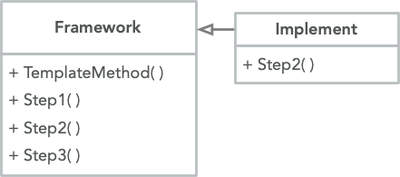

<br>

基类声明步骤的基本框架

```cpp
class Base {
    void a() {
        cout << 'a' << endl;
    }
    virtual void b() = 0;

public:
    void execute() {
        a();
        b();
    }
};
```

由派生类实现方法的一些步骤

```cpp
class Implement : public Base {
    void b() override {
        cout << 'b' << endl;
    }
};

int main()
{
    Base* b = new Implement;
    b->execute();
}
```
