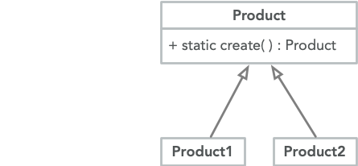

<br>

创建者无需实现子类的创建而直接调用工厂方法

```cpp
class Vehicle {
public:
    virtual void call() = 0;
    static Vehicle* create(int id);
};

class Taxi : public Vehicle {
public:
    void call() override {
        cout << "Taxi" << endl;
    }
};

class Bus : public Vehicle {
public:
    void call() override {
        cout << "Bus" << endl;
    }
};

Vehicle* Vehicle::create(int id) {
    if (id == 1)
        return new Taxi;
    else if (id == 2)
        return new Bus;
}

int main()
{
    Vehicle* taxi = Vehicle::create(1);
    Vehicle* bus = Vehicle::create(2);
    taxi->call();
    bus->call();
}
```
