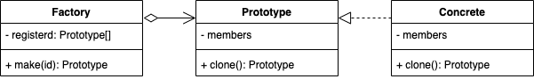

新的模型应该由一个注册表维护，可以由一个工厂类实现，或者是写在产品基类里。

```cpp
From: auto obj = new ConcreteType();
To: auto obj = factory->RegisteredProtoObjects[ID].clone();
```

原型模式需要初始化，注册原型的对象。

```cpp
class Model {
public:
    virtual Model* clone() = 0;
    virtual void call() = 0;
};

class Factory {
public:
    static Model* make(int id);
private:
    static Model* registered[2];
};

class MarkI : public Model {
public:
    Model* clone() override {
        return new MarkI;
    }
    void call() override {
        cout << "1" << endl;
    }
};

class MarkII : public Model {
public:
    Model* clone() override {
        return new MarkII;
    }
    void call() override {
        cout << "2" << endl;
    }
};

Model* Factory::registered[] = {
        new MarkI, new MarkII
};

Model* Factory::make(int id) {
    return registered[id]->clone();
}

int main()
{
    Model* m1 = Factory::make(0);
    Model* m2 = Factory::make(1);
    m1->call();
    m2->call();
}

```
