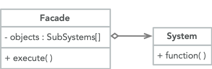

<br>

将复杂的类隐藏在一个外观类的接口背后

```cpp
class Facade {
public:
    Facade(System1* sys1, System2* sys2) : s1(sys1), s2(sys2) {};
    void run() {
        s1->run();
        s2->run();
    }
private:
    System1* s1;
    System2* s2;
};
```

子系统可以交互而且不知道外观类的存在

```cpp
class System1 {
public:
    void run() { cout << 1 << endl; }
};

class System2 {
public:
    void run() { cout << 2 << endl; }
};

int main()
{
    System1* sys1;
    System2* sys2;
    Facade facade(sys1, sys2);
    facade.run();
}
```
